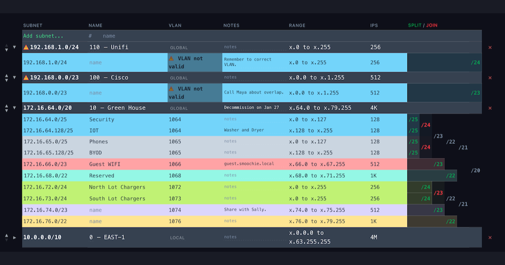

# slashwhat

**Free visual subnet calculator and CIDR planner.**

Split and join subnets interactively with color-coded tables. No signup, no
backend — runs entirely in your browser.

**Live at [slashwhat.net](https://slashwhat.net)**



## Features

- **Interactive split/join** — click to divide any subnet into two equal halves, click to merge siblings back
- **IPv4 & IPv6** — full dual-stack support with correct address math for both
- **Multiple trees** — add multiple CIDR blocks side by side, each with independent split/join trees
- **Color-coded tables** — 17 themes (Pastel, Neon, Forest, Ocean, and more) across 7 color modes (Sibling, Cousins, Cycle, Alternating, Zebra, Manual, None)
- **VLAN macro language** — auto-assign VLAN IDs with expressions like `100+{o3}`, with 6 built-in presets
- **Naming** — hierarchical name labels with automatic or manual mode and separator inheritance
- **Description & Notes** — per-subnet free-text fields for documenting purpose and details
- **Undo/redo** — 8-level snapshot stack, Ctrl+Z / Ctrl+Shift+Z (Cmd on Mac)
- **Save/load** — JSON configs with schema validation, plus localStorage autosave
- **CSV export** — visible columns with current display settings, formula-injection safe
- **Column controls** — 12 columns, reorderable, individually hideable and restorable
- **Simple/Advanced modes** — clean defaults for beginners, full column control for power users
- **Dark/light themes** — toggle in the header, respects system preference
- **Zero dependencies** — vanilla JS, no framework, no npm runtime dependencies

## Documentation

- [Getting Started](https://slashwhat.net/getting-started.html) — CIDR notation tutorial and first-split walkthrough
- [Documentation](https://slashwhat.net/docs.html) — column reference, VLAN macros, color modes, keyboard shortcuts, save/export
- [Subnetting Strategy](https://slashwhat.net/strategy.html) — real-world recipes for offices, campuses, cloud (AWS/Azure/GCP), and data centers
- [About](https://slashwhat.net/about.html) — how the project was built, architecture, pipeline, and war stories

## Quick start

### Prerequisites

- **Git** — [git-scm.com/downloads](https://git-scm.com/downloads)
- **Docker Desktop** — [docker.com/get-started](https://www.docker.com/get-started/) (includes Docker Compose)

### Steps

```sh
# 1. Clone the repository
git clone https://github.com/rubythetor/slashwhat.git
cd slashwhat

# 2. Build and start the container
docker compose up --build -d

# 3. Open in your browser
open http://localhost:8080        # macOS
# xdg-open http://localhost:8080  # Linux
# start http://localhost:8080     # Windows
```

The app is now running. Type a CIDR block (e.g. `10.0.0.0/16`) and start
splitting.

```sh
# Stop the container when done
docker compose down

# Rebuild after making changes to src/
docker compose up --build -d
```

No `npm install`, no build step, no Node.js required for local development.
Source files use native ES modules loaded directly by the browser. Docker
provides nginx to serve the static files — that's all it does.

## Architecture

```text
src/
├── js/
│   ├── core/    15 modules — Pure logic (subnet math, tree ops, config). No DOM.
│   ├── views/   18 modules — DOM rendering, event handling, UI orchestration.
│   └── ui/       3 modules — Shared utilities (theme toggle, toasts, mode switch).
├── css/         12 files   — Modular stylesheets (tokens, layout, components, table).
└── *.html        5 pages   — index, about, docs, getting-started, strategy
```

All computation happens client-side. There is no server, no API, no database.
The entire app is static HTML/CSS/JS served by nginx.

### Core modules

| Module | Purpose |
|--------|---------|
| `subnet.js` | Subnet class: address math, masks, host counts |
| `splitter.js` | Binary tree model: build, split, merge, traverse |
| `forest.js` | Multi-tree container: add, remove, reorder, overlap detection |
| `naming.js` | Hierarchical name labels and separator inheritance |
| `parse.js` | Input parsing and display formatting |
| `config.js` | Serialize/deserialize forest state for save/load/undo |
| `config-validate.js` | Schema validation for saved config JSON |
| `bitmask.js` | Bitwise IP address operations (AND, OR, shifts) |
| `ipv4.js` | IPv4 parsing, formatting, arithmetic |
| `ipv6.js` | IPv6 parsing, formatting, expansion |
| `constants.js` | Shared constants (RFC ranges, reserved blocks) |
| `color-assign.js` | Per-row color assignment from theme palettes |
| `color-themes.js` | 17 color theme definitions and palette lookups |
| `undo.js` | Undo/redo manager with 8-level snapshot stack |
| `vlan-macro.js` | VLAN ID template expansion and preset definitions |

## Testing

```sh
# Run tests with coverage (via Docker, no local Node required)
docker run --rm -v "$(pwd):/app" -w /app node:22-alpine \
  node --test --experimental-test-coverage 'tests/*.test.js'
```

17 test files, 613 tests, zero test dependencies (`node:test` + `node:assert`).
Coverage target is 95% on all core modules (current: 95.66% line, 97.80%
branch, 97.99% function).

## CI/CD pipeline

Every push to `main` runs a seven-stage pipeline. Each automated stage must
pass before the next starts.

| Stage | Job | Description |
|-------|-----|-------------|
| 1. Check | `preflight` | Scans for secrets, forbidden files, debug artifacts, oversized files |
| 1. Check | `unit-tests` | Full test suite with coverage gate (runs in parallel with preflight) |
| 2. Build | `build-dist` | esbuild bundles JS into a single file, minifies CSS, content-hash cache busting |
| 3. Deploy | `deploy-staging` | rsync `dist/` to staging nginx |
| 4. Verify | `smoke-test` | Hits live staging, checks HTTP status, DOM structure, every referenced asset |
| 5. Release | `deploy-production` | Manual gate — deploys to Cloudflare Pages via wrangler |
| 6. Mirror | `push-github` | Manual gate — pushes to this GitHub repo |

## Credits

This project is 100% written by AI. A network engineer and an AI coding agent
(Claude) built it from scratch using natural language prompts.

Inspired by [davidc.net](https://www.davidc.net/sites/default/subnets/subnets.html).
Also recommends [visualsubnetcalc.com](https://visualsubnetcalc.com).

## License

[MIT](LICENSE) — © 2026 slashwhat
